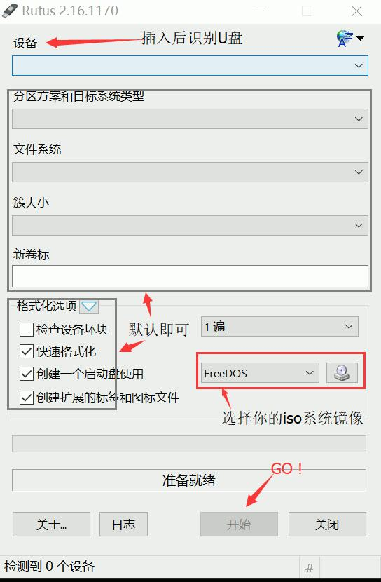
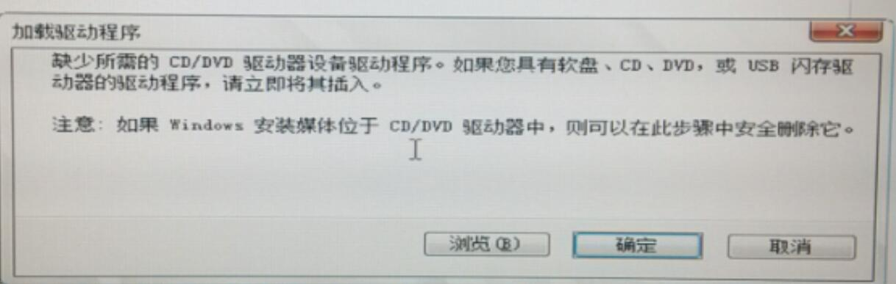
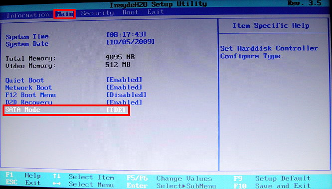
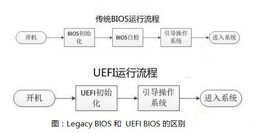

# Dell-win7重装问题

<i style="color:grey">Last Updated: 2017-8-15</i>  

  Page views: 
 

* 硬件环境：Dell-15-7559

## 创建系统盘
### 1. 装系统就两个点：系统装载 + 系统引导

#### 装载：
将系统镜像文件存储到介质中。

#### 引导：
设置 bios 为 USB 设备(U盘重装)启动。

---

### 2. 所用工具
* yufus  

[中文官网](https://rufus.akeo.ie/?locale=zh_CN)  
Create bootable USB drives the easy way。开源软件就是爽。  
使用场景：利用可引导的ISO格式的镜像（Windows，Linux，UEFI等）创建成USB安装盘。  

使用：

---

### Q1:安装WIN7时提示“缺少所需的CD/DVD驱动器设备驱动程序”：

  
1. 重新插拔U盘，或者更换其他USB接口。可能存在USB3.0对win7驱动的兼容性问题，把U盘插到2.0口上试试。

2. 检查问题原因：在出现提示时。在卡住的界面按[SHIFT+F10]唤出CMD，输入diskpart，然后用list disk命令查看，系统是否识别了U盘。   
但如果系统识别了你的U盘，还是出现缺少驱动的提示，可能是制作的启动盘存在问题。重新制作U盘(更换电脑做/换个镜像)。

3. 某些主板在 BIOS 里改 ACHI 到 IDE 模式即可安装 ，如果不行，改回 ACHI 尝试方法3。  

<安装时未截图，图转网络>

4. 识别分区问题，尝试命令提示符/工具重新分区。

* 上述都无法解决： *

win7不自带USB驱动无法被识别？？？  
在这个论坛找到了解决方案<http://nga.178.com/read.php?tid=8806890>感谢！      
[技嘉官网 win7 安装盘制作的解决方案：](http://www.gigabyte.cn/WebPage/-79/usb.html)

(直接贴图)

 
按照此方法制作的系统盘，在Dell-15-7559可以正常安装 win7。装好后记得打补丁和装驱动。

# 最后：遇到问题尽量首先找官方文档，去所购电脑的品牌官网寻求文档帮助。

*html注释里还有一些乱七八糟查到的资料，没来得及整理，客官可以参考。*

<!--系统重装方法&原理

##关于系统装机，杂

###一个讨论：
[dd命令制作u盘启动](http://forum.ubuntu.org.cn/viewtopic.php?t=468087)

原理问题：

1. 在ubuntu下可以用dd命令将一个系统iso镜像文件直接写入优盘,然后用优盘启动就可以进行系统的安装了,我就是用这种方法安装ubuntu的,而且不需要改任何配置文件.,原理上,本来系统镜像都是放在光盘里的(iso文件系统),启动时选择光盘启动就可以进入系统安装了.我用过win7的系统盘这样装过系统.在原理上,不管是优盘还是光盘,只要启动时从这个设备介质启动,而且里面包含iso文件系统格式的系统镜像,就应该可以了,对吗?可是,我利用dd命令将win8的系统镜像iso写入优盘,开机就找不到u盘启动的选项了,即使找到了,也不能进入系统安装界面,why?

1.1. ISO 本來是 光盤的 映像檔

1.2. 光盤啟動機制 與 U 盤啟動機制 是不同的
意思是 光盤 的 ISO 與 U 盤 的 ISO 是不同的
意思是 光盤 的 ISO 燒錄到 U 盤是無法開機的

1.3. 如果把 光盤 的 ISO 與 U 盤 的 ISO 混合在同一個 ISO 這個 ISO 稱為 Hybrid ISO

1.4. 如何判別 ISO 是 Hybrid ISO
http://superuser.com/questions/683210/h ... s-a-hybrid

1.5. Ubuntu 自 11.10 開始 所有的 ISO 都是 Hybrid ISO
意思是 同一個 ISO 可以用來 燒錄 CD 也可以用來燒錄 燒錄 U 盤

1.6. dd 無法用來燒錄 CD 只能用來燒錄 U 盤

1.7. dd 用來燒錄 Windows 8 ISO 到 U 盤 參閱
http://askubuntu.com/a/365661/198920
sudo dd if=/path/to/iso/windows.iso of=/dev/sdg bs=4M; sync

2.virtualbox之所以可以直接运行iso镜像 因为他有一个模拟光驱 是将iso文件装入了此模拟光驱 而非hybridiso文件镜像之所以不能直接dd进优盘 是因为标准不对 优盘并不是光驱 而hybridiso针对优盘做了改动 其他的像unetbootin utraliso等工具之所以可以将iso文件写入优盘 也是对优盘做了特定操作的 主要就是写入mbr 这样才能启动起来 不知道我说的对不对

    2.1. 不完全對
    cd 啟動機制 與 usb 啟動機制 不同
    所以 cd 啟動的 iso 與 usb 啟動的 iso 不同
    把 cd 啟動的 iso 與 usb 啟動的 iso 合併到 同一個 iso 稱為 hybrid iso
    拿 hybrid iso 燒錄到 cd 是選取 cd 啟動的 iso 來燒錄
    拿 hybrid iso 燒錄到 usb 是選取 usb 啟動的 iso 來燒錄
    意思是 跟 燒錄工具程式 無關
    當然 燒錄工具程式 要能識別 cd 啟動的 iso 與 usb 啟動的 iso
    1-1. 你所描述的比較接近 Isohybrid 指令的功能
    http://www.syslinux.org/wiki/index.php/Isohybrid

3.我还想问两个问题 ubuntu安装程序的时候 触发器是什么？

    3.2. 你說的 触发器是 Launcher 嗎
    https://help.ubuntu.com/14.10/ubuntu-he ... intro.html
    如果不是 請提供英文名詞單字

    3.3.我说的触发器是“Processing triggers for libc-bin”中的triggers

    3.4. 看看 這一篇 能否幫你
    https://wiki.ubuntu.com/DpkgTriggers

4.系统安装的过程中都做了什么操作？原理？
    
    http://www.dedoimedo.com/computers/ubuntu-14-04-install-guide.html

###重装后的系统启动方式：

UEFI BIOS 全称“统一的可扩展固件接口”(Unified Extensible Firmware Interface)，是一种详细描述类型接口的标准。UEFI BIOS 包括 UEFI引导启动 和 Legacy引导启动。可通过更改BIOS中的相关参数改变启动方式。

UEFI是一种新的主板引导初始化的标注设置，具有开机启动速度快、安全性高和支持大容量硬盘的特点，其旨在提高软件互操作性和解决BIOS的局限性。。UEFI方式减少了BIOS的自检过程，让硬件初始化以及引导系统变得简洁快速，缩短开机时间。

Legacy BIOS 为传统的BIOS(Basic Input Output System 基本输入输出系统)。每一台普通的电脑都会有一个BIOS，用于加载电脑最基本的程式码，担负着初始化硬件，检测硬件功能以及引导操作系统的任务。
    

legacy引导对应的是MBR硬盘模式；UEFI对应必须为GPT

###"烧写"の解释：
    这个词最早是用在一次性可编程只读存储器上。

    不同于更早的集成电路，这样的存储器出厂时是一枚空白的芯片，可以通过特殊设备写入内容。怎么写？高电压。

    比方说芯片正常的读取电压是3.3V，那么写入就需要16V的电压，这会永久性地改变写入位置的物理组成。写入之后再对特定针脚施加16V，烧断高压电路，这样这枚OTPNVM就无法再次写入了。这个过程实际上就是微观地烧掉了一些芯片内部的东西。

    之后这个词又很正确地用在了可写光盘上。同样的，写入可写光盘原理也根本就是用大功率（远高于普通读取）的激光使可写光盘表面的特定位置的染料变性，使反光度发生变化，于是信息就记录上去了。这也是微观上烧掉了一些东西。所以烧这个词就普遍地用于了光盘写入和ROM写入。不过之后随着技术发展，很多非一次性的ROM出现了。
    写入的原理也不再是永久性的改变。但是因为依旧是写入ROM，所以烧这个词还是沿用了，不过仅仅限于用在写入单独一块不经常复写的芯片上。你看大家就不说烧一个U盘或者烧SSD。

    [作者：沈万马;来源：知乎](https://www.zhihu.com/question/36366933/answer/67194315)

###双硬盘装win7：
    以往的习惯都是用U盘启动winPE系统，将系统直接映射过去，屡试不爽。因为很容易在网上找到纯净的windows系统的gho文件。
    Q1：首先就是系统boot进入BIOS无法识别u盘和新装的固态硬盘。但是原来的机械硬盘中的win8还是可以启动，并且可以在win8中读到固态硬盘和U盘。是要在BIOS中设置boot为legacy support模式，以前是UEFI模式，只能在启动的时候识别原有的机械硬盘。
    Q2：在启动 F12进入U盘的系统以后发现之前装的那个winPE读不出两个硬盘，是因为这个老的winPE没有装新的SATA的读写驱动。要是新装的winPE应该都是不会有这个问题的。但是也只要在BIOS中将SATA的读写模式修改为IDE的模式，还是可以读出来的，本来是ACHI的。接下来是映射C盘。
    有人说，装系统的时候要把机械硬盘拔掉，不然启动的引导程序会出问题。我觉得要是采用winPE的这种映射方式装系统应该是不会出现类似的问题的，要是那种傻瓜似的系统安装方法真有可能会出现启动引导混乱。
    Q3：新的映射的系统（固态硬盘中的）无法启动，计算机无法识别。有人说是引导问题，有人说是没有激活。但是我在winPE中DG软件中看到的激活时灰色的，所以完全不知道有没有激活，是无法激活。没有激活，所以引导开机引导程序也无法生效。原因是固态硬盘磁盘格式不正确，需要在DG中将GPT（GUID Partition Table）换成MBR（Master Boot Record）的格式，然后删除所有分区，再分区才可以激活，在这之后再对固态硬盘装系统就可以正确引导和启动了。
    Q4：就是即使在boot位置把固态硬盘调到第一了还是没法默认从固态硬盘的系统启动，那里有个选项需改成legcy first才行，不然总是先从UEFI也就是之前的机械硬盘启动了。

-->

| 标题：Dell-15-7559-win7重装问题  
| 作者：强王  
| 发布：2017-08-15  
| 来源：http://qiangwang.site/blog/eni-Dell-Win7-Reshipment  
| 版权声明： 本文由 强王 原创，采用[保留署名-非商业性使用-禁止演绎 4.0-国际许可协议](https://creativecommons.org/licenses/by-nc-nd/4.0/deed.zh)  
| 转载请保留以上声明信息