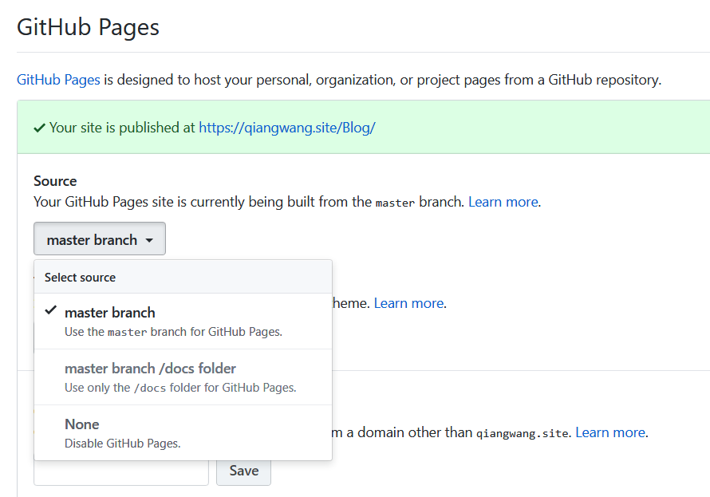

# 连接github

1. git环境

2. 生成秘钥key
    `$ ssh-keygen -t rsa `
    连续三个回车，key就生成，默认存放路径：`/Users/wangqiang/.ssh`

3. 打开自己的Github主页，在settings里面设置`SSH and GPG keys`

4. 打开生成的`id_ras.pub`文件，将公钥公布给github，注意文件中的所有文本都要po上去。

5. 测试连接 
    `$ ssh -T git@github.com`
    第一次测试时会弹出警告，填yes后回车

6. 设置username和email
    $ git config --global user.name "q1angwang"
    $ git config --global user.email "565603068@qq.com"
    在把本项目上传到github之前设置username和email，每次commit都会记录下username和email。

---

# 初始化

# 设置全局大小写敏感

默认不敏感，下面的操作需要在终端切到任意git仓库下操作。

    ~~$ git config --global core.ignorecase false~~
    $ git config core.ignorecase false

完事后`.gitconfig`文件内容显示：

    [core]
        quotepath = false
        ignorecase = false
    [user]
        name = q1angwang
        email = qiangwanghhh@gmail.com

## 初始化git时就需要设置；

否则项目文件夹/文件命名不规范，整理后重新 clone 下来后就会发现，之前将所有文件名首字母改成大写的改动全部没变。

非常影响效率，之前的整理又得重新做一遍。

在团队使用Git的时候，尤其是多人合作的项目，经常会出现一个问题，就是由于同一个文件名大小写不一致导致无法合并的问题。

那我们应该怎么来解决呢?

可以使用`git rm –cached`将冲突的文件从Git仓库的缓存中删除，然后改名后再加入到git中

git rm --cached <filename>
mv <old_filename> <new_filename>
git add <new_filename>
git commit -m 'rename <new_filename>' <new_filename>

当然，为了一劳永逸，我们可以让团队成员都更改配置git的大小写敏感，避免某些windows用户继续制造这样的问题。

git config core.ignorecase false

---

# 项目

## 0. 创建项目

Github 上操作虽多，但是都是围绕一个个的项目展开的。

绿色的 [+ New repository]

可选 `Initialize this repository with a README`，然后创建这个项目。

Create Repository 按钮的上方还有两个选择框：
`.gitignore`&`LICENSE` 
选择这两项后会多两个文本文件，一个是 .gitignore 文件，另一个是 LICENSE 文件。若暂不选，可后期自己用编辑器新建。

创建后的页面：

`commit  `  
    --last commit  保存版本/版本
    -- commit message 可用版本留言来定位特定的某次修改
    项目首页的[N] commits 是个链接，点进为项目历史的页面。进入可关注why who when what commitID

`branch`

### 1. GitHub添加许可证

Q: 当我创建一个GitHub项目时，默认选择了None。如何添加许可证到已经创建的项目?

A: 去项目下，添加新文件，以`License.txt`或 `License.md`命名。 
输入文件名称后，许可选择器就会出现，选择许可类型即可。

### 2. 为每个项目设置主页
(创建可选分支不继承master的内容)

各个项目的主页一般与master分开，放在 gh-pages 分支的(不继承master分支的历史和文件)

在项目版本库中创建一个名为gh-pages的分支，并向其中添加静态网页即可，放到 gh-pages 分支上的内容会被公开成网页。

如果项目的Git版本库中包含了名为gh-pages分支的话，则表明该项目提供静态网页构成的主页，可以通过网址<http://<user-id>.github.io/<project-name>>访问。

需要一个干净的gh-pages分支：

    $ git symbolic-ref HEAD refs/heads/gh-pages
    $ rm .git/index
    $ printf "hello world.\n" > index.html
    $ git add index.html
    $ git commit -m "branch gh-pages init."
    $ git push -u origin gh-pages
对应释义：

    1. 用Git底层命令：`git symbolic-ref`命令将当前工作分支由master切换到一个尚不存在的分支gh-pages。  
    2. 删除暂存区文件，即相当于清空暂存区。  
    3. 创建项目首页index.html。  
    4. 添加文件index.html到暂存区。  
    5. 执行提交。提交完毕分支gh-pages完成创建。  
    6. 执行推送命令，在GitHub远程版本库创建分支gh-pages(已经建立过`push`操作)。  

* 若是在web中建立了Git-Pages，可从版本库中获取并切换到`gh-pages`分支进行静态网页编辑。

    $ git fetch
    $ git checkout gh-pages

---
# 仓库操作

## 更新仓库

1. 选择一个仓库的`clone with ssh`，eg：
    $ git clone git@github.com:q1angwang/Notes.git

2. 操作本地仓库：

    `$ git add .`
    //$ git add --all #(-A) #将删除文件操作也加到stages中
    ~~//`git add .`只能stages新文件和被修改文件，没有被删除文件~~
    `$ git commit -m'first commit'`
    //需要把改动commit进版本库再push

[建议]：每次add后，再使用`git status`确认新操作stage了

3. 把本地仓库推送到远程仓库 ：
    $ git push origin master

## 删除文件操作(git仓库中)

$ rm test.txt
$ git rm test.txt
$ git add all #可提交未跟踪、修改和删除文件。
$ git add .可以提交未跟踪和修改文件，但是不处理删除文件。
$ git commit -m "remove test.txt"
$ git push

### 删除文件夹

$ git rm -rf <dir>
$ git add -A
$ git commit -m “delete dir”
$ git push

refer: [git 删除文件](https://www.jianshu.com/p/c3ff8f0da85e)

---

# Issue pushing new code in Github

## Q1：
➜  Notes git:(master) git push origin master
To github.com:q1angwang/Notes.git
 ! [rejected]        master -> master (fetch first)
error: failed to push some refs to 'git@github.com:q1angwang/Notes.git'
hint: Updates were rejected because the remote contains work that you do
hint: not have locally. This is usually caused by another repository pushing
hint: to the same ref. You may want to first integrate the remote changes
hint: (e.g., 'git pull ...') before pushing again.
hint: See the 'Note about fast-forwards' in 'git push --help' for details.

A：
Previously, your have a push not from this terminal, and your local repository doesn't know about this commit yet. Hence: `Updates were rejected because the remote contains work that you do not have locally.`

    git pull && git push origin master
    //or
    git push -f origin master
BEWARE: Using force can change the history for other folks on the same project. Basically, if you don't care about a file being deleted for everyone, just go ahead. Especially if you're the only dev on the project.

## Q2:
➜  Notes git:(master) git push origin master
To github.com:q1angwang/Notes.git
! [rejected]     master -> master (non-fast-forward) 
error: failed to push some refs to 'git@github.com:q1angwang/Notes.git' 
hint: Updates were rejected because the tip of your current branch is behind
hint: its remote counterpart. Integrate the remote changes (e.g.
hint: 'git pull ...') before pushing again.
hint: See the 'Note about fast-forwards' in 'git push --help' for details.

当前分支代码上传到master分支上时出错，github中的部分文件不在本地代码目录，可以通过如下命令进行代码合并

    $ git pull --rebase origin master

//pull=fetch+merge

此时再执行语句 `git push -u origin master`即可完成代码上传到github

## Q3:
Untracked files: (use "git add <file>..." to include in what will be committed)

在状态报告中可以看到新建的README文件出现在“Untracked files”下面。未跟踪的文件意味着Git在之前的快照（提交）中没有这些文件；Git 不会自动将之纳入跟踪范围，除非你明明白白地告诉它“我需要跟踪该文件”，因而不用担心把临时文件什么的也归入版本管理。不过现在的例子中，我们确实想要跟踪管理 README 这个文件。

# branch have diverged
## Q：

    $ git status
    On branch master
    Your branch and 'origin/master' have diverged,
    and have 22 and 23 different commits each, respectively.
      (use "git pull" to merge the remote branch into yours)

    nothing to commit, working tree clean

    WQ@DESKTOP-3BGM28T MINGW64 ~/Documents/CloudFile/Work/Notes/2019Course (master)
    $ git merge origin/master
    fatal: refusing to merge

## 解决1：

    git merge master --allow-unrelated-histories

## 解决2：

    $ git rebase origin/master 
    $ git pull --rebase 
    $ git push origin master 

# 为什么Github没有记录你的Contributions

解决方法来源：
http://xunli.xyz/2016/01/09/github-not-count/

因为git初始化设定时没有设定正确的用户名和邮箱（主要是邮箱），具体可以参考Github官方写的help文档

https://help.github.com/en/articles/why-are-my-contributions-not-showing-up-on-my-profile

条件：
1. commits使用的email地址是与你的Github账号相关联的
2. 这些commits是在在默认分支上（通常是master）

排查：
本地repo里用git log，查看commit记录上的个人邮箱是否正确

强制恢复之前不是自己名字的commit记录：
见作者原文方法

## 完成后需设置本地git配置
git config --global user.email "565603068@qq.com"
git config --global user.name "q1angwang"
