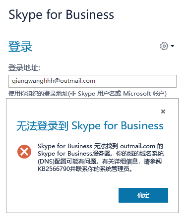
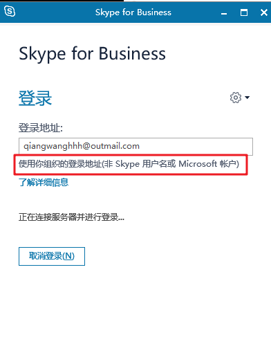

# Skype在win10上的踩坑使用

## 缘起：
海外高校导师需要Skype进行视频面试。

## 0. win10自带
自带的是Skype for business：  

使用outlook账号，一直显示"正在连接服务器饼登陆"，并在等待后报错：  

关注下登陆地址后的一行话

是个典型的问题

## 安装

在官网1 <https://www.skype.com/zh-Hans/get-skype/> 贴出的获取地址会跳转到Microsoft store 【ms-windows-store://pdp/?productid=9WZDNCRFJ364&cid=scom-web-store】

所安装的Store版Skype在xd校园网/xian联通4G网测试下，均不可以登陆成功。

## 换用baidu下载的安装包解决了

官网2 <http://skype.gmw.cn/down/>  
可以直接得到安装包，正常登陆正常通话正常视频。

## 其他
- Windows叫Microsoft store，你说AppStore别人会误解你所在的平台。

- 紧急(建立)联系可以通过<https://web.skype.com>网页版获得服务，网页版无法语音视频。