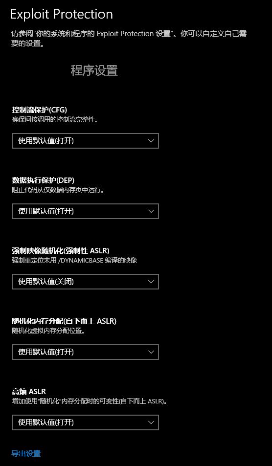
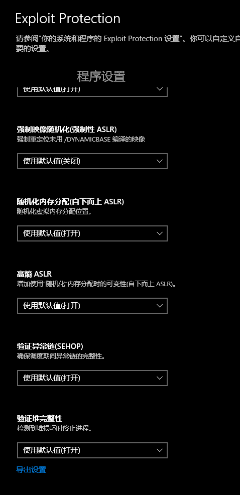
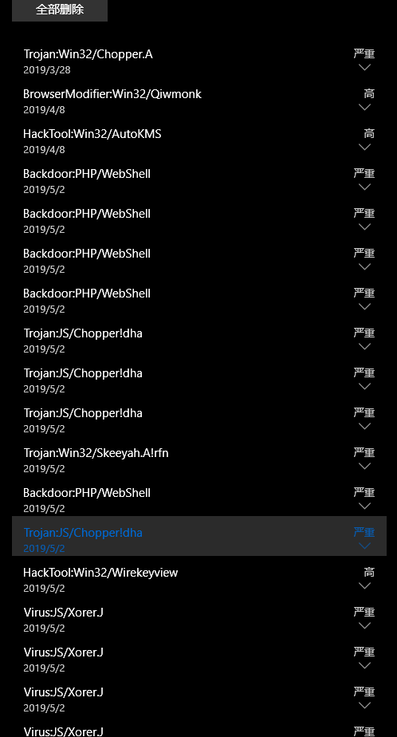

# win10安全相关总结

# win10开启的保护

所设内核隔离：

识别效果：

# win-关闭安全保护

## 问题
批量整理硬盘时，以前存的小马、大马、cve测试文件，都被最新的windows defender识别为"无法完成操作，因为文件包含病毒"

## 环境
win1803

## 目标：设置Windows Defender不要启用实时保护。

进入windows defender安全中心

进入右下角设置，点击病毒和威胁防护设置，将‘实时保护’关闭

# windows-gg原因

1. 系统某个重要文件没了
2. 忽然掉电了
3. 固态老了掉数据