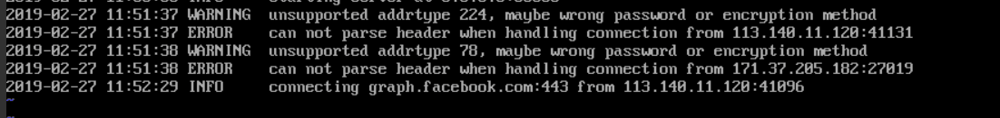

# 数据转发故障后的排查

## 步骤

1. 排除本地客户端问题

    - 排除了本地客户端的问题，换了别的转发地址可以

    - 本地使用错误：sslocal 只支持 socks5，你的 wget 用 http 代理肯定是不行的，怎么会 wget 成功

2. 尝试定位服务端问题

    通过 抓包 / 让程序输出log(了解错误原因)

    https://github.com/shadowsocks/shadowsocks/issues/793

3. 查看日志 (服务端)

    `/var/log/shadowsocks.log`

## 解决

查看日志得到的信息：

- 不断的连接错误log：
    被port sniffing: Never mind because these logs are generated when your shadowsocks service's port gets scanned by wild robots or script kiddies.  
    可以：iptables、Fail2ban(入侵保护的开源框架)、[自带](https://github.com/shadowsocks/shadowsocks/wiki/Ban-Brute-Force-Crackers)

    用法参考(不一定对)：https://github.com/shadowsocks/shadowsocks/issues/959#issuecomment-335755123

    //请检查iptables以查看规则是否已创建

- 日志中出现ipv6地址：

    估计是转发软件自动升级了，并采用了默认的ipv6。调整即可

- restart app

- restart system

- rebuild system

## . 可能原因

- wall的刺探：https://github.com/shadowsocks/shadowsocks/issues/793#issuecomment-286703620

- isp的问题

- 虚惊：出现的 SS 日志并不是错误报告, 只是使用状态日志

- 加密方式不对引起的，建议服务器端和客户端都设置成rc4-md5方式。

## 抓包麻烦 用log代替：

你是在什么地方加的呢？不用抓包，只要知道出错的数据是什么就行了。

你这样改一下试试：
把 shadowsocks/shadowsocks 文件夹下的 common.py 文件的203、204行的如下内容：

        logging.warn('unsupported addrtype %d, maybe wrong password or '
                     'encryption method' % addrtype)
替换为：

        import binascii
        logging.warn('unsupported addrtype %d, maybe wrong password or '
                     'encryption method %s' % (addrtype, binascii.hexlify(data)))

## 开启转发软件的自带保护

Shadowsocks 2.6.2+ output the IPs that try to brute force crack your password.

You can use utils/autoban.py to ban them.

python autoban.py < /var/log/shadowsocks.log
Use -c to specify with how many failure times it should be considered as an attack. Default is 3.

To continue watching for the log file:

nohup tail -F /var/log/shadowsocks.log | python autoban.py >log 2>log & 
