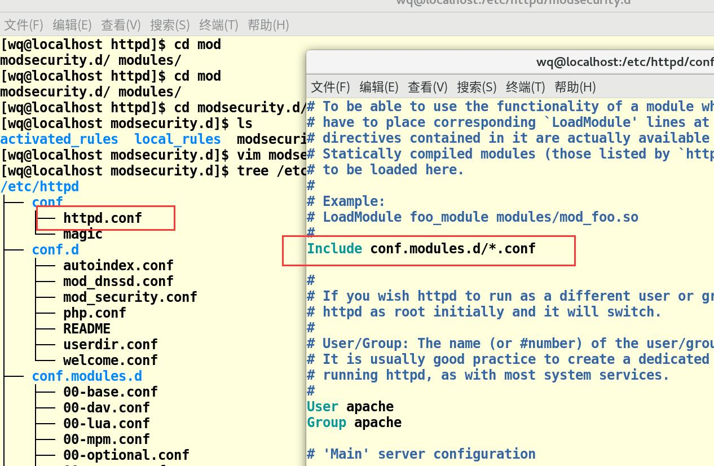
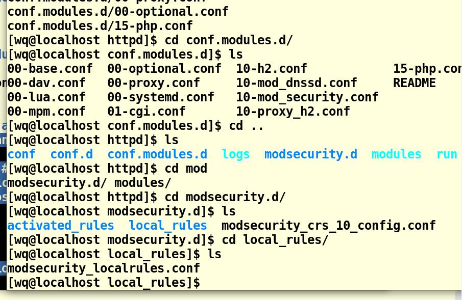
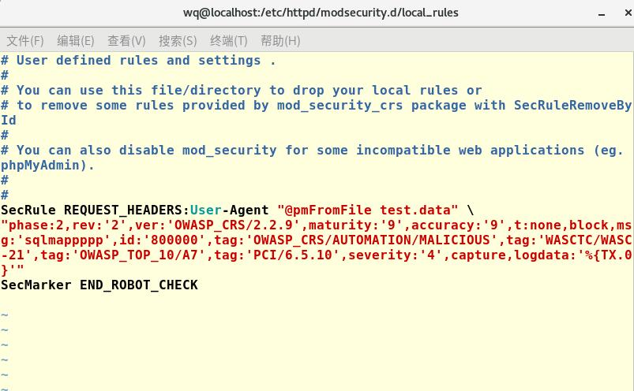
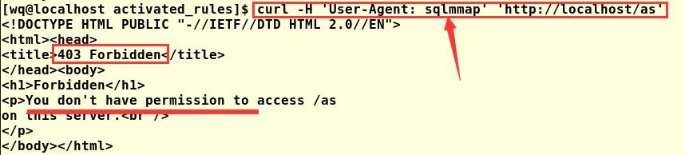
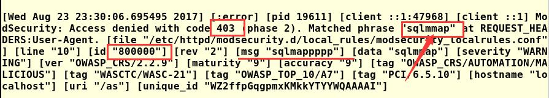
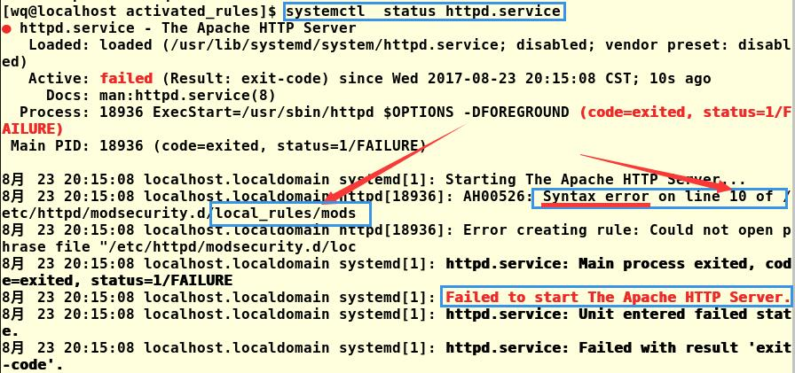

# waf

<i style="color:grey">Last Updated: 2017-8-25</i>  

  Page views: 
 

## 安装
需要yum两个东西，一个是基础支持，一个是官方配置。

[reference]<https://github.com/SpiderLabs/ModSecurity/wiki/Reference-Manual>

## 自己配置

#### 流程
1. 先测试(开启)httpd, mariadb。服务正常

2. 打开log文件：$ cd /var/log/httpd
                $ tail -f access_log

    打开mod_security的配置文件：$ cd /etc/httpd/
    
    不知道目录情况，tree 一下当前目录  

    /etc/httpd/conf.d 下面的 mod_security.conf 是总的配置文件，控制开关、基础变量、！include ../modsecurity.d/activated_rules 

    把conf.d/mod_security.conf 最后三行 include 的 # activated_rules 注释掉，注意留下来的那两个。

    参考 activated_rules 下面的
    > [wq@localhost activated_rules]$ vim modsecurity_crs_35_bad_robots.conf 

    自己在 /etc/httpd/modsecutiry.d/local_rules 下面建一个规则。
    语法有错的话重启 apache 会报错，跟这报错看就好。(然后不断回滚，看哪一步修改使错误发生)
    

    配置好后，自己加的那行：
    > test.data：sqlmmap

    打一发测试：

    access_log 日志：
---

#### 坑点:
 
##### 1. 文档？
需要过一遍文档再配置。

 
##### 2. 想当然的配置
格式错误，需要读文件没给配

直接复制了原 robots 配置的某一行，报错！

Q1. modsecurity_35_scanners.data 是原来 activexx 下面的 data 数据文件，缺少，无法读取。

* A: 自己创建一个test.data 呗

Q2. id:'900000'，900000那边被 ../cod_security.conf 的配置给占用了。

* A: 改为其他：800000

Q3. "chain,phase:2,

* A: 你如果不 chain 的链式推断的话，得去掉这个，否则单个规则无法chain，还会报错。

* Q4. 结束配置需要一行 END：SecMarker END_ROBOT_CHECK

#### tips：
1. vim 修改文件时，记得 sudo。
2. 修改配置一定得重启。$ sudo service httpd restart

---

| 标题：Markdown 参考  
| 作者：强王  
| 发布：2017-8-25 
| 来源：http://qiangwang.site/blog/waf1
| 版权声明： 本文由 强王 原创，采用[保留署名-非商业性使用-禁止演绎 4.0-国际许可协议](https://creativecommons.org/licenses/by-nc-nd/4.0/deed.zh)  
| 转载请保留以上声明信息

<!--

正则学习，linux 的正则。
-->